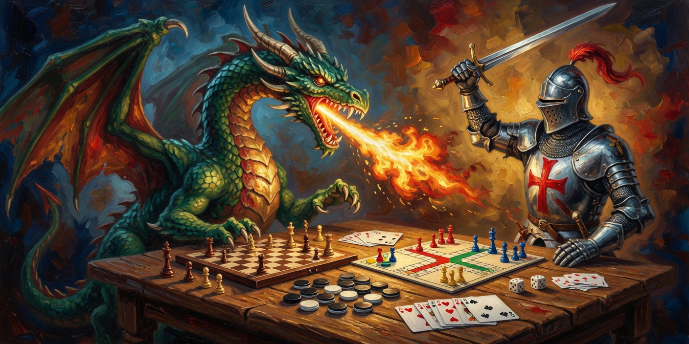

[**EN**](README.md) · [ES](README.ES.md) · [FR](README.FR.md) · [DE](README.DE.md)

# Grok Multi Game platform (telegram version)

This is an experiment with a ridiculous premise and a wholesome excuse.

**Can an agent bot be the Dungeon Master?** Not a rules engine with 400 pages of errata. A brain. Tonight it runs a dragon hunt. Tomorrow it deals 21. On Saturday it becomes Parchís with extra spite. Same group, same friends, new table.

The channel is **Telegram**, on purpose. Kids already have it. Parents already have it. Nobody has to install *Yet Another Game Client 3.2 (beta)* and create an account named `xXDarkWizard2009Xx`. If the phone can ping a group chat, it can sit at this table.

That is the old internet sneaking back in through a modern door. Before graphics cards had more fans than a football stadium, people played on **BBS boards**, ASCII dungeons, and MUDs where a dragon was three characters of fire and a lot of imagination:

```
  /\
 /  \    "You hear dice in the dark."
< DM >
 \  /
  \/
```

Same energy. Type a command. Get a story. Argue about whether the orc really had line of sight. The felt is a chat window; the master is Grok.

I built it **for fun, for my son**, so he can drag his friends into a game without a rulebook, a shop, or a “minimum 40 GB download.” One group. One bot. An adult hits `/cmd new-game …` in plain language. Grok invents the rest. When they are done wrecking the lighthouse / the deck / the kingdom, `/cmd clear all` sweeps the crumbs like a very obedient tavern keeper.

If it works, we get a pocket tavern that fits in a schoolbag. If it does not, we still get a funny evening and some ASCII cards. Either way: the knight stays on the box art, the kids stay on Telegram, and the grown-up does not have to explain Steam to a twelve-year-old at 22:17.

**Want to open your own table?** The boring (necessary) bits are in **[SETUP.md](SETUP.md)**.

---

## The three pieces that talk to each other

This repo is only **one** of three complementary parts. They are not three copies of the same program. Each one owns a different job.

```
  players
     |
     v
[3] Telegram group          the table. Humans type /cmd. Nobody opens Grok.
     |
     |  Bot API (HTTPS out)
     v
[2] Python on a PC          THIS repository (grokgame).
     |                       Parses /cmd, stores the table JSON, rolls dice
     |                       when asked, talks to Telegram, wakes the GM.
     |
     |  signed webhook / API
     v
[1] Grok Agent / Automation the brain. Invents the game from new-game,
                             answers in the table language, returns say.
```

| Piece | Where it lives | What it is allowed to decide |
|---|---|---|
| **1. Agent** | Grok cloud (subscription) | What the game *is*. Verbs after `new-game`. Narrative. Rules the admin just invented. |
| **2. Python on the PC** | Your machine, this repo, `python -m mesa.main` | Grammar `/cmd`, who is admin, JSON on disk, dice math, Telegram I/O. Not the story. |
| **3. Telegram** | The group you create by hand | The only surface players see. The app never creates the group. |

The PC process must stay up or the group goes mute. The Agent sleeps between turns: this app wakes it (webhook). A Grok Automation webhook answers **`202` and an empty body** — that ping is a doorbell, not the spoken line. Getting `say` back into the group still needs either `XAI_API_KEY` (see SETUP) or the sibling project below.

**Sibling, no PC in the path:** [grok2telegram](https://github.com/antonio-castellon/grok2telegram) runs the same `/cmd` pipe **on the Agent Bot virtual machine**. That process long-polls Telegram from Grok's cloud (outbound HTTPS only) and `sendMessage`s the reply into the group. Use it when the house PC must not be a server and you do not want the paid inference API.

Do not run *both* `getUpdates` loops at once (PC + VM) against the same bot token. Telegram hands each update to only one waiter; you will lose messages or fight yourself.

---

## Play without Grok (no API key)

Grok as a live DM needs an `XAI_API_KEY` (paid API). You do **not** need that to try the tavern.

Set `GM_BACKEND=mock` in `.env` and run `python -m mesa.main`. The bot is then a little cartridge compilation in Python: same `/cmd` grammar, no agent, no token bill.

```
/cmd list games
/cmd load <id>
```

`<id>` is the first column (admin loads the game):

| `/cmd load <id>` | Then play with |
|---|---|
| `blackjack` | `/cmd join` `/cmd otra` `/cmd planto` — ASCII 21, `GANADOR ES:` |
| `rpg` | `/cmd join` `look` `go norte` `attack` `inventory` |
| `riddle` | `/cmd guess` `hint` `next` |
| `trivia` | `/cmd a` `b` `c` `d` |
| `dice` | `/cmd join` `/cmd roll` (2d6) |
| `rps` | `/cmd piedra` `papel` `tijera` |
| `number` | `/cmd guess 42` (1–100) |
| `tictactoe` | `/cmd join` `/cmd put 5` |

These are mock-ups, not Grok. They exist so a kid can play tonight while the grown-up decides whether to feed the API dragon.

---

A player’s entire spellbook, more or less:

```
/cmd new-game  …describe the game like you would to a patient uncle
/cmd join
/cmd cmd list
/cmd clear all     (adults only: wipe the group)
```

Everything else — `otra`, `planto`, `act`, `guess`, `cast` — is invented by Grok for *that* night’s game. Tomorrow the verbs will be different. That is the feature, not a bug. The 90s compilation cartridge on the shelf never promised you would play the same title twice.
